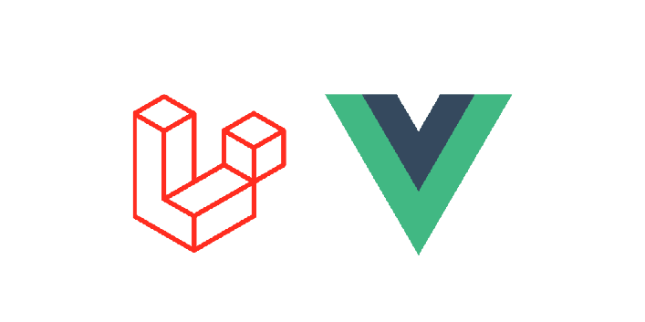

# Laravel 8 Vue 3 Boilerplate

  

A Laravel 8 Single Page Application boilerplate using Vue.js 3, Bootstrap 4 with:

-   Authentication using Laravel Sanctum.
-   Front-end with vue 3.

## Main dependencies

Front-end:

-   [Vue 3]
-   [VueRouter 4]
-   [Vuex 4]
-   [Bootstrap 4]
-   [Laravel Mix]

Back-end:

-   [Laravel 8](https://github.com/laravel/laravel)
-   [Laravel Sanctum](https://github.com/laravel/sanctum)

## Steps to run it:

Rename the .env.example file to .env, and fill it with your local info, then:

Install PHP and JavaScript dependencies:

    composer install
    npm install

Generate Laravel keys:

    php artisan key:generate

Migrate and seed the database:

    php artisan migrate

To run the project:

    php artisan serve

The application will be available on http://localhost:8000
